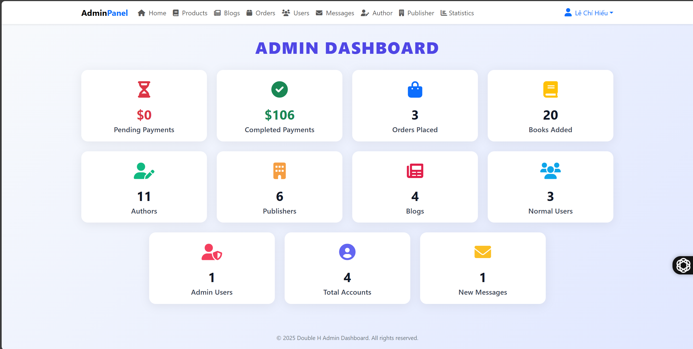
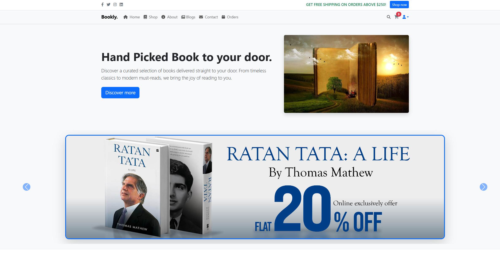

# Bookly - Online Bookstore

<!-- (Insert project illustration here) -->

Bookly is a modern, feature-rich online bookstore web application built with **PHP**, **MySQL**, and **Bootstrap 5**. It offers a seamless experience for users to browse, search, and purchase books, and provides a robust admin panel for managing products, orders, users, and messages.

---

## ✨ Features

### 🛒 User Features

- **User Authentication:** Secure registration, login, and logout.
- **Product Catalog:** Browse, search, and filter books by name, author, or publisher.
- **Product Details:** View detailed information and images for each book.
- **Shopping Cart:** Add, update, and remove books from your cart.
- **Buy Now:** Instantly purchase a single book with one click.
- **Checkout:** Place orders with address and payment method.
- **Order History:** View all your placed orders.
- **Contact Form:** Send messages to the admin for support.

### 🛠️ Admin Features

- **Dashboard:** Overview of orders, users, products, and messages.
- **Product Management:** Add, update, and delete books with images.
- **Order Management:** View, update payment status, delete, and export orders to Excel.
- **User Management:** View and delete user accounts.
- **Message Management:** View and delete contact messages.

### 💎 UI/UX

- **Responsive Design:** Fully responsive using Bootstrap 5.
- **Modern Look:** Clean, user-friendly interface with Font Awesome icons.
- **Interactive Animations:** Product cards grow on hover for a lively shopping experience.
- **Beautiful Forms:** Animated, modern login and registration forms.
- **Carousel Ribbons:** Featured authors and publishers with image carousels.
- **No Custom CSS Required:** All styling is handled by Bootstrap and CDN stylesheets, with minimal custom CSS for effects.

---

## 🚀 Technologies Used

- **Backend:**  
    
  
- **Frontend:**  
    
  
- **Database:**  
  MySQL
- **Other:**  
  HTML5, CSS3, JavaScript (optional for interactivity)

---

## 📦 Getting Started

### Prerequisites

- PHP 7.x or higher
- MySQL 8.x or compatible
- Web server (e.g., Apache, Nginx)
- Composer (optional, for local development)

### Installation

1. **Clone the repository:**

   ```bash
   git clone https://github.com/hieu1704/book-store-app.git
   cd bookly
   ```

2. **Import the database:**

   - Import the provided SQL file (`shop_db_with_data.sql`) into your MySQL server.
   - Update `config.php` with your database credentials.
   - Confige https://console.cloud.google.com to login with google account.

3. **Configure your web server:**

   - Point your web server’s document root to the project folder.

4. **Start using Bookly:**
   - Open your browser and go to `http://localhost/book-store-app` (or your configured domain).

---

## 📁 Folder Structure

```
project/
│
├── admin_contacts.php
├── admin_header.php
├── admin_orders.php
├── admin_page.php
├── admin_products.php
├── admin_users.php
├── cart.php
├── checkout.php
├── config.php
├── contact.php
├── footer.php
├── header.php
├── home.php
├── login.php
├── logout.php
├── orders.php
├── register.php
├── search_page.php
├── shop.php
├── about.php
├── uploaded_img/         # Uploaded product images
├── images/               # Static images (about, authors, etc.)
└── js/
    └── script.js         # (Optional) Custom JS for user pages
```

---

## 🛠️ Customization

- **Images:** Place your product and author images in the `uploaded_img/` and `images/` folders.
- **Branding:** Update the site name, logo, and footer in `header.php` and `footer.php`.
- **Contact Info:** Edit contact details in `footer.php`.
- **Animations:** Product card hover and form fade-in are handled by minimal custom CSS.

---

## 📝 Notes

- All styling is handled by Bootstrap 5 and Font Awesome via CDN.
- Minimal custom CSS is used for product card hover and form animation.
- Admin and user authentication is session-based.
- "Buy now" and "Add to cart" are both supported for flexible shopping.
- Admin can export orders to Excel (CSV) with one click.

---

**Made with ❤️ by Double H**







